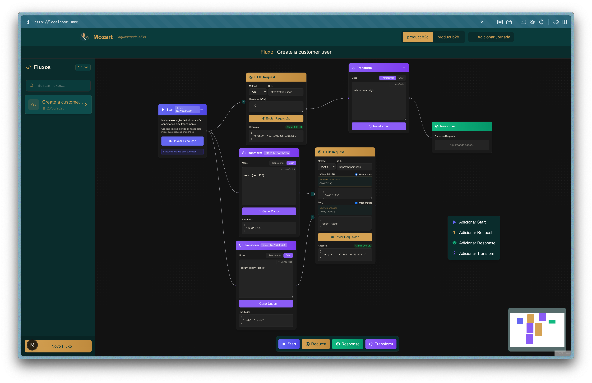

<p align="center">
  
</p>

<h1 align="center">Mozart</h1>
<p align="center"><b>Orchestrate your APIs visually, robustly, and open source.</b></p>

<p align="center">
  <a href="#features">Features</a> •
  <a href="#getting-started">Getting Started</a> •
  <a href="#documentation">Documentation</a> •
  <a href="#contributing">Contributing</a> •
  <a href="#license">License</a>
</p>

---

## What is Mozart?

Mozart is a visual API orchestrator, inspired by Postman Flows, but more robust and open source. Build, test, and automate API workflows with a beautiful and intuitive interface.



- **Visual orchestration:** Drag, drop, and connect nodes to create complex API flows.
- **Custom transformations:** Use JavaScript to transform data between steps.
- **Reusable journeys and flows:** Organize your API automations in journeys and flows.
- **Open source:** MIT licensed, community-driven.

> **Português?** Leia a documentação em [docs/README.pt-BR.md](docs/README.pt-BR.md).

---

## Features

- Visual flow editor (powered by [React Flow](https://reactflow.dev/))
- HTTP Request/Response nodes
- Data transformation nodes (with JS code)
- Start node for triggering flows
- Context menu and keyboard shortcuts
- Multiple journeys and flows
- Modern, beautiful UI (Tailwind CSS + Heroicons)
- Extensible and hackable

---

## Getting Started

### 1. Clone the repository

```bash
git clone https://github.com/seu-usuario/mozart.git
cd mozart
```

### 2. Install dependencies
```bash
npm install
```

### 3. Run locally
```bash
npm run dev
```

Open http://localhost:3000 in your browser.

### Documentation
- Usage Guide
- Architecture
- Contributing
For documentation in Portuguese, see docs/README.pt-BR.md.

### Contributing
We welcome contributions! Please read [CONTRIBUTING.md](docs/CONTRIBUTING.md) before submitting a pull request.
